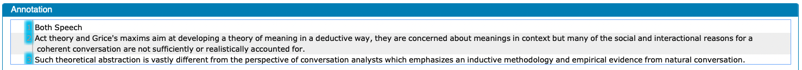
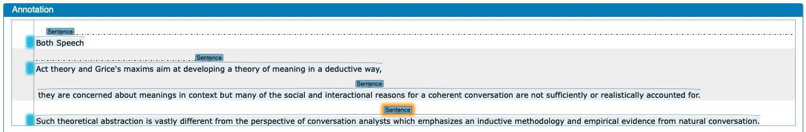

# Step 0 — Sentence boundary detection

This part is necessary only when the annotation file contained issues in sentence boundaries.

In the annotation files, we will have a sentence populate a numbered section in the annotation area (see the following figure). When no problems are present in the annotation file, the annotation window should look like the following.

But when there are sentence boundary detection issue, the annotation window would look like the following.

One obvious error in this file is that the phrase `Both Speech` is separated from the second part `Act theory ... a deductive way`. The issue is that the computer recognized these as two separate sentences, which is an error. 

Another issue we see is that the writer may used `,` to indicate the sentence boundary, which was not recognized as sentence boundary by the automated sentence detection. So we might propose that `Both Speech Act Theory ... in a deductive way,` and `they are concerned about meanings in context ... accounted for.` as two independent sentences.

If we follow this analysis, the sentence boundary annotation should look like the following.

Again, this part is only necessary for files with sentence boundary errors. So you would most likely skip this layer. 
You do not have to provide any annotation when there is no issue.
