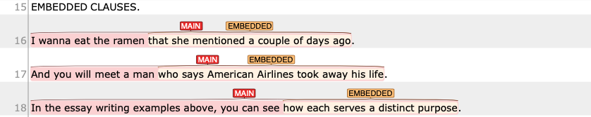

## Embedded clauses

{: .def}
> a type of dependent clause that function as a part of another clause. That is, an embedded clause is included in a subject, object of another clause (i.e., complement clause) or function as an adjective to modify a noun (i.e., relative clause). Inserted clauses, such as parataxis, are also considered as a type of embedded clause.

In the following examples, embedded clauses are _italicized_.

- The paper argued _[that average price is not a meaningful measure of market power]_. (The clause functions as an object of argue.)
- I wanna eat the ramen _[that she mentioned a couple of days ago]_. (The clause modifies "the ramen".)
- And you will meet a man _[who says American Airlines took away his life]_. (The clause modifies "a man".)
- The idea _[that a democratic school is one where kids have an equal vote (Embedded 1)]_ , _[I think (Embedded 2)]_ , is a mistake. (The clause is a complement of a noun.)

In webanno, you will annotate these in the following manner:

Here are some major types of embedded clauses.

### Verb + (that-)clause (Embedded)
This pattern typically occurs when clausal complement (such as that-clause) follows mental or communication verbs.

- The author argued _that television has helped to shrink the relative distance between people and countries_.
- I think _Mary teaches French_.
- It appears _that maximum price fixing does the greatest harm when set below a competitive level_.

### Noun + (that-)clause (Embedded)
This patterns occurs when a (that-)clause elaborates content of the noun expression. 

- _The idea that the company has a clear responsibility to the incident_ was rejected by the judge.
- Their argument was based on _the belief that a happy ending is a certainty_.
- Our conclusion is drawn based on _the fact that there was a correlation between the intensifier use and their perception of social identity_.

### Relative clauses (Embedded)
A relative clause is where a clause is used to modify a noun (antecedent). There are two main categories in the use of relative clause.

The first type of relative clause occures when a noun is modified by a whole clause. It is typically used to identify which noun they are talking about out of all the possible cases of the noun.
- The analysis should be regarded as _a tool which alerts us to the potential conflicts_.

The other type of relative clause typically elaborates the content of the whole clause or introduces additional information about the noun expression/whole clause.

- We included all participants into the analysis with the exception of _the Italian participants, which was necessary to control for their native languages._ 

### Present and Past participle modifier (NOT an EMBEDDED clause in our case)

In our annotation scheme, we do not treat present and past participle phrases under EMBEDDED.

Therefore, while finite relative clauses are considered as `Embedded`, the participle phrases are not.

- The scientist discovering DNA was Frederich Meischer. (No EMBEDDED)
- The scientist [who discovered DNA]`EMBEDDED` was Frederich Meischer.

- How old Is the boy riding the surfboard near the pier? (No EMBEDDED)
- How old is that boy [who is riding the surfboard]`EMBEDDED` near the pier?

- The surfer tossed bv the huge wave won the competition last year. (No EMBEDDED)
- The surfer [who was tossed by the huge wave]`EMBEDDED` won the competition last year.

## Bibliography
