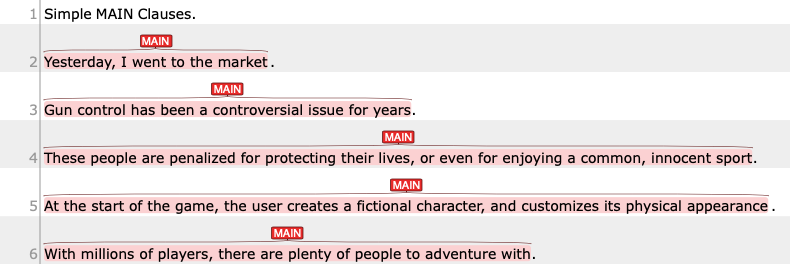
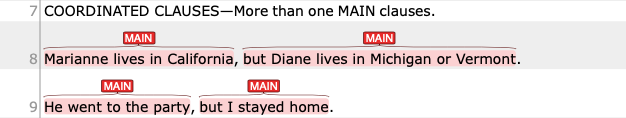

## Simple MAIN clauses

{: .def}
> A clause that can stand alone to make a complete sentence.

In addition to "simple" sentence structure, we will include imperative sentences (commands) as a independent main clause.

In webanno, you will annotate the clause in the following manner:

## Coordinated clauses – More than one MAIN clauses

{: .def}
> Coordinated clauses are independent/main clauses that are connected via coordinating conjunctions (e.g., `and`, `but`, `or`).

You can also consider colon `:` and semi-colon `:` as an implicit coordination of two MAIN clauses.

| Independent clause            | Coordinated conjunction | Independent clause                  |
| :---------------------------- | :---------------------- | :---------------------------------- |
| Marianne lives in California, | but                     | Diane lives in Michigan or Vermont. |
| He went to the party,         | and                     | I stayed home.                      |
| I went to the store           | but                     | they were closed                    |
| I went to the store           | ;                       | they were closed                    |

In webanno, you will annotate the clause in the following manner:

{: .caution}
>When the scope of the coordination is verb phrases—that is, not explicit subject is introducted in the second or later coordinated elements, we will still treat them in a single `MAIN` clause.
> For example:
> The following is one main clause with one T-unit
> - [[I went to see the movie and got home late yesterday]`MAIN`]`T-UNIT`.
> 
> But the following should be two main clauses, because the second element have an explicit subject:
> 
> - [[I went to see the movie]`MAIN`]`T-UNIT` [[and I got home late yesterday]`MAIN`]`T-UNIT`
