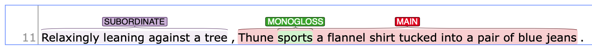

## SUBORDINATE clauses

{: .def}
> a dependent clause that is attached to a main clause through the use of subordinate conjunctions (e.g., `because`, `when`) or adverbial particle

Subordinate clause can take a form of [adverbial clause](#adverbial-clauses) or [non-finite adverbial particle clause](#adverbial-particle-clauses) (see details below.)

When you are not sure about the clause status of the adverbial element, see [this page](1_Basic_grammar.md#distinguishing-adverbial-clauses-and-adverbial-phrases).

A subordinate clause can either follow or preceed the main clause. 

| Main clause                                   | Subordinate clause                                                      |
| :-------------------------------------------- | :---------------------------------------------------------------------- |
| It was hard to write a book together          | **because they live so far apart**.  (adverbial clause)                 |
| Peggy frequently calls                        | **because she wants to stay in touch**.  (adverbial clause)             |
| Betty danced joyfully,                        | **never suspecting what was about to happen**. (particle clause)        |
| They decided to wait for dawn,                | **each hiker taking his two-hour turn at watch**. (particle clause)     |
| The authors presented a new piece of evidence | **concluding that the effects of DLL is noteworthy**. (particle clause) |

| Subordinate clause                                                 | Main clause                             |
| :----------------------------------------------------------------- | :-------------------------------------- |
| **Although Marianne and Diane live far apart**, (adverbial clause) | they are still friends.                 |
| **As far as I am concerned**,  (adverbial clause)                  | there is not much study on this topic.  |
| **Working diligently on his paper**,  (particle clause)            | John began to type up the bibliography. |
| **Worn out from all the work**,   (particle clause)                | John decided to relax.                  |

Following sections describes each type in details.
### Adverbial clauses 

{: .def}
>Adverbial clause is a type of subordinate clause, which typically add 'secondary information' to the main clause.

Common subordinate conjunctions, which introduce a subordinate clause, include:
- **Concessions**: although, as, as though, even, even though, though, just as though, whereas, while
- **Conditions**: even if, if, in case, provided (that), unless, as long as, as much as, as far as,
- **Temporal**: after, as, as soon as, as long as, before, once, since, still, till, until, when, whenever, while
- **Contrasts**: although, though, whereas, while, rather than, 
- **Causal relations**: as, because, in order (that), so that, now that, since

More examples include:

| Subordinate clause                                                                                    | Main clause                                                                                             |
| :---------------------------------------------------------------------------------------------------- | :------------------------------------------------------------------------------------------------------ |
| **Because the steps are made of a smooth, polished—and therefore slippery—stone**,                    | the BTA should’ve taken precautions to clean the steps in such wintry conditions.                       |
| **Although some medical ethicists claim that cloning will lead to designer children** (R. Miller 12), | others note that the advantages for medical research outweigh this consideration (A. Miller 46).        |
| **While the Supreme Court rejected the “quality of care” argument in the federation case**,           | the oligopolistic characteristics and purchasing structure of insurance make this outcome unsurprising. |

Note that the meaning of the subordinating conjunction depends on the context. 

In webanno, you will annotate these in the following manner:

### Adverbial particle clauses

In some cases, a subordinate clause can also be realized with non-finite particles (e.g., `-ing`, `-ed`, `-en`).

| Subordinate clause                                         | Main clause                                                         |
| :--------------------------------------------------------- | :------------------------------------------------------------------ |
| **Having worked on his paper since 4 P.M.**,               | John stopped at 8 to watch the DePaul basketball game.              |
| **Having been working on his paper for more than a week**, | John decided he would turn it in without further revision.          |
| **Being worn out from all the work**,                      | John decided to relax for the evening.                              |
| **The bus drivers being on strike**,                       | many people had to get to work using other means of transportation. |
| **Relaxingly leaning against a tree** ,                    | Thune sports a flannel shirt tucked into a pair of blue jeans .     |

| Main clause                            | Subordinate clause                             |
| :------------------------------------- | :--------------------------------------------- |
| Betty danced joyfully,                 | **never suspecting what was about to happen**. |
| Sheila ignored the dog and the TV set, | **deeply engrossed in the new book**.          |

On webanno, you should segment the clause in the following manner.

---
