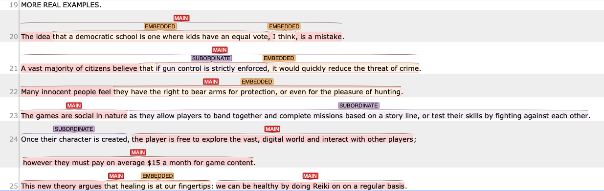

## Real examples—Mixture of different clause types

{: .label .label-red}
Needs revision to reflect T-unit

In real example, we will deal with mixture of different types. 
This is illustrated in the following examples.

### Comments on the real examples

20: The subject of this sentence is `The idea`, and the main verb is `is`. There are two embedded clauses. One is a complement of the noun `idea`, which elaborates on the content of that idea (i.e., complement clause). The other is `I think`, which function as attached (i.e., parataxic) node to the main clause. 

21: We have one additional subordinate clause and an additional embedded clause in this example. The embedded clause is the content of the main verb (i.e., the content of what the citizens believe). Grammatically, this is called a complement clause of the main verb. The embedded clause has two parts, Embedded-main, which we do not tag, and Embedded-subordinate, which we will treat as a subordinate clause.

22: This example has one additional embedded clause functioning as the complement of the verb `feel`.

23: This example has one additional subordinate clause. The subordinate clause is introduced by a subordinate conjunction `as`, which add secondary information to the main clause.

24: This example has two main clauses, and there is one subordinate clause, which I consider attached to the first main clause. We have two main clauses because both parts has finite verbs "the player **is** ..." and "they must **pay** ...". The semi-colon works as implicit coordination between the clauses. Finally, the subordinate clause is introduced by a subordinate conjunction `once`, which add extra Temporal information to the main clause (c.f., `before/after/since Y do X`).

25: This has two main clauses, coordinated implicitly by a colon `:`. The first MAIN clause has additional embedded clause, which is the complement of the verb `argue`.  

## Problems in the sentence segmentation

Sometimes, the annotation dataset may have weird lines. This may include completely empty lines, or just a word in line. It can also have cases where in-text citations are ill-formatted.

1. IF the dataset has empty lines, skip annotating that line.
2. If the sentence is imcomplete, use the `FRAGMENT` tag.
  - In 1999, (FRAGMENT)
  - are examples of this concept (FRAGMENT)

## References
Larsen-Freeman, D., & Celce-Murcia, M. (2016). *The grammar book. Form, meaning and use for English language teachers* (3rd eds).
