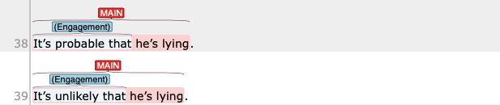
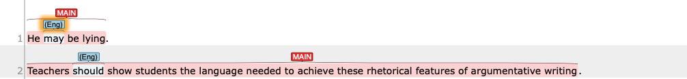
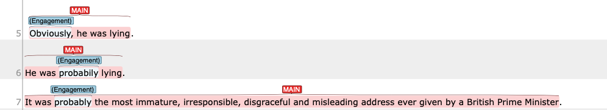
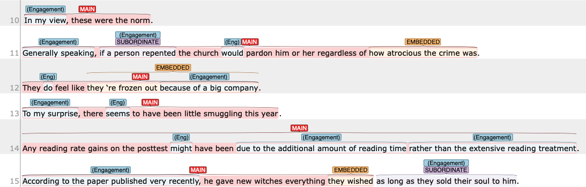
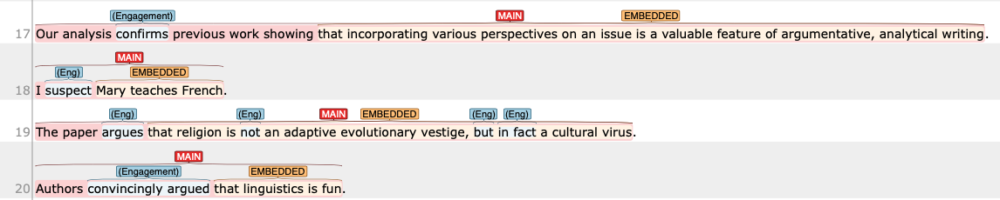
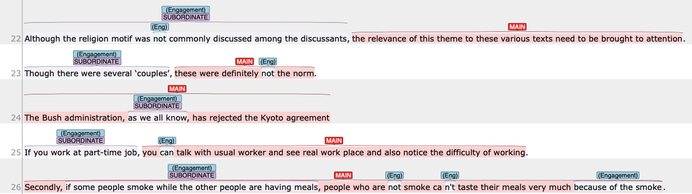
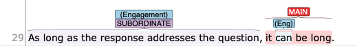
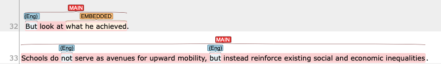
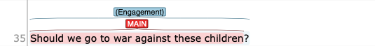
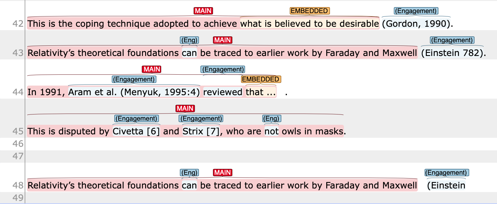

{: lg}

# Step 2 — Engagement Spans

{: .label .label-red}
Needs revision

This section deals with structural/grammatical issues during the annotation, particularly the decisions involving where to put the tag. Each section below deals with possible grammatical structure for emgagement, and which items to put a tag on.

In the example in this document, the span for which the tag should be put is shown in **Bold** face. 

{: .label .label-green}
Updated on 12th, Sep

| Features                                                                                                                 | Example items                                                     | Where to put a tag                             |
| ------------------------------------------------------------------------------------------------------------------------ | ----------------------------------------------------------------- | ---------------------------------------------- |
| [Verb phrases](#verb-phrases)                                                                                            | `runs`, `had seen`, `have been identified`, `have shown`, etc.    | on the entire verb phrase (except model verbs) |
| [Passive construction](#passive-construction)                                                                            | `is determined`, `was said`                                       | on the entire verb phrase (except model verbs) |
| [Mental or communication verbs](#mental-or-communication-verbs)                                                          | `think`, `say`, `tell`                                            | on the entire verb phrase                      |
| [It/there is X that/to construction](#it-is-x-thatto-as-interpersonal-metaphor)                                          | `It is unlikely that` ....                                        | See the rule below                             |
| [emphatic do](#emphatic-do)                                                                                              | I `do believe` that ...                                           | `do + lexical verb`                            |
| [Modal verbs](#modal-verbs)                                                                                              | `can`, `have to`                                                  | on the item                                    |
| [Single-word adverbs](#single-word-adverbs)                                                                              | `obviously`, `sure`                                               | on the item                                    |
| [Adverbial/ Prepositional constituency](#multi-word-adverbs-adverbial-and-prepositional-constituency)                    | `in my view`, `to me`, `in actual fact`                           | the entire phrase                              |
| [(Adverbial) subordinate clauses](#subordinate-clauseincluding-both-single-word-and-multi-word-subordinate-conjunctions) | `as SV`, `when SV`, `if SV`, `as long as SV`, `whether or not SV` | the entire subordinate clause                  |
| [Coordinating conjunctions](#coordinating-conjunctions)                                                                  | `but`, `and`, `yet`                                               | on the item                                    |
| [Question](#questions)                                                                                                   | `Who thinks that smoking do no harm in 21st century?`             | on the entire question                         |
| [Comment clause/ parataxis](#comment-clauseparataxis)                                                                    | see examples                                                      | on the entire comment clause                   |
| [Shell nouns](#nominalized-construction)                                                                                 | `the author's belief that/of` ...                                 | `Det + premodifiers + Noun + that/of`          |
| [No + Noun construction](#no--noun-construction)                                                                         | `No rules`, `None of the idea`                                    | `No + head noun`                               |
| [Citations](#citations)                                                                                                  | `Kyle (2020)`; `(Kyle, 2020)`                                     | See details                                    |

{: .tips}
>When in doubt, you can test whether the span by separating the propositional content and the author's stance on it.
>
>Consider the following example:
> - A few years ago, I wrote expressing my concern that the village of West Linton, Peeblesshire, had 'moved'.
>
> In this example, the writer of this sentence expressed their concern by writing to someone. The content of the concern (i.e., propositional content) is the idea that `the village of West Linton, Peeblesshire, had 'moved'`.
>This is the actual piece of information/idea that were written. So, we will consider that `ENGAGEMENT` or stances are encoded in the rest. Based on this, I would suggest the following:
>
>- A few years ago, I **wrote expressing my concern that** the village of West Linton, Peeblesshire, had 'moved'.
>
>Technically, the pattern, `ACTION verb + COMMUNICATION verb + Shell noun + that` is not in the list above. However, we can think that the writing contained the concern, which is the core stance here. As such `wrote expressing concerns that` would be a good candidate as a distinct `Engagement` span.

## Verb phrases

NEW in version 2
{: .label .label-green}

When an engagement meaning is realized by a verb phrase, you will put a tag on the entire verb phrase (including Auxiliary + lexical verbs + particles).
One exception to note is when a [modal auxiliary](#modal-verbs) is in the verb phrase. In such cases, we will treat the modal verb separately from the verb phrase.

- Discussants correctly **pointed out** that Bernardino of Siena, Martin Le Franc, and the anonymous author of the Errores Gazariorum all **have** an even more aggressive campaign against witches than **did** the authors of our previous readings.
- Even though he **had taken** all his medication, his leg **did n’t look** any better.
- They **have found** it very difficult to understand each other ‘s lifestyles.

{: .note}
>Previously (in version 1), we have put a tag on "most lexically heavy verbs".
>  

## It is X that/to— as Interpersonal metaphor

Updated in version 2
{: .label .label-green}

When there is `It is X that ~`, `It is X to ~` or `there is/are X that` construction, we will tag the entire span of this construction. 
This decision is based on the fact that these construction function as introducing the stance of the writer as a whole (they almost function as chunks). 

When the `that-clause` govern the following clause, the tag spans are from `It/There` to `that`:
- **It’s probable/likely/possible that** he’s lying.
- **It is possible that** it is your duty to tell me.
- **It is absolutely clear to me that** what Charlotte was arguing was that Crouching Tiger was a bad film to which liberal audiences imputed a significance shaped by their own prejudices about Chinese cinema and the Chinese in general.
- **There is no doubt that** globalization has a deep effect on China.
- However, **there is mounting evidence that** processes of language acquisition, use, and change are not independent of one another but are facets of the same system.

When a `to-infinitive` govern the following clause, the tag spans are from `It` to the adjectival complement.
- **It is possible** for a layer of ice to form under the circumstances.
- But **it is likely** to have an impact in the near future.
- It was found, for example, that **it is more likely** to occur in NNS–NNS dyads rather than between NSs and NNSs (Varonis & Gass, 1985 ).
- **It would be possible** to suppose, for instance, that the tnre Schrodinger-like equation involves non-linearities.

In the following pattern, we can identify two strategies.
- It seems fairly obvious to most people that Watson tremendously oversimplified the learning process.

First, `It seems fairly obvious` gets a span, because this is a variant of `It is X to`.
Second, `seems` should get another tag because they add `ENTERTAIN` value to the author's assessment using `fairly obvious`.

- **It *seems* fairly obvious** to most people that Watson tremendously oversimplified the learning process.

## Passive construction

{: .label .label-green}
New in Version 2

When we put a tag on passive construction (e.g., `MONOGLOSS`, `ATTRIBUTE`), we include `copula verb + lexical verb` in the span.

- The data **was collected** in the local community.
- The allegations **are believed** to involve several teenagen aged from 12 to 18.
- At least some of the abuse **is claimed** to have taken place last year.
- It **was expected** that they would interview him later today.

## Modal verbs

When an engagement meaning is realized by a modal verbs (e.g., can, may, might, have to, etc.), you will put a tag on the modal.
- He **may** be lying.
- Teachers **should** show students the language needed to achieve these rhetorical features of argumentative writing.

### List of modal verbs

Following Halliday & Mathiessen (2014, p. 145), the following items are considered as modal verbs (Modal operators) in this project:
- can, may, could, might, (dare), will, would, should, is to, was to, must, ought to, need to, have/has/had to
- needn't, don't need to, don't have to, won't, wouldn't, shouldn't, (isn't/wasn't), mustn't, oughtn't to, can't, couldn't, (mayn't, mightn't, haven't to).

## Emphatic do

A typical realization of `PRONOUNCE` is the use of emphatic do. In this case, we will put a tag on `do + lexical verb`:

- We `do believe` that researchers should view this disciplinary division as an opportunity rather than an obstacle.

This is a strategy to prevent any `ENTERTAIN` tagged on `believe` when there is already a `PRONOUNCE` in the sentence.

## Single-word adverbs

When an engagement meaning is realized by a single word adverbs (e.g., probably, surprisingly, etc.), you will put a tag on the item.
- **Obviously**, he was lying. 
- He was **probabily** lying,

## Multi-word adverbs/ adverbial and prepositional constituency

When an engagement meaning is realized by a multi-word adverbs, such as prepositional phrases, adverbial phrases, you will put a tag on the whole constituency.
- **In my view**, these were the norm.
- **Generally speaking**, if a person repented the church would pardon him or her regardless of how atrocious the crime was.
- They do feel like they 're frozen out **because of a big company**.
- Any reading rate gains on the posttest might have been **due to the additional amount of reading time rather than the extensive reading treatment**.
- **According to Andersen (1991)**, the Congruence Principle presents an explanation as to why errors occur.
- The camel is **without doubt** one of the natural world's most remarkable forms of transport.
- Then we realized that you had to **sort of like** turn it off.
- **As expected**, the volume of retail sales rose 0.5 per cent in August.

## Mental or Communication verbs

When an engagement meaning is realized by a mental or communication verbs, you will put a tag on the lexical verb.
- Our analysis **confirms** previous work showing that incorporating various perspectives on an issue is a valuable feature of argumentative, analytical writing.

## Subordinate clause—including both single-word and multi-word subordinate conjunctions

Common subordinate conjunctions, which introduce a subordinate clause, include:
- **Concessions**: although, as, as though, even, even though, though, just as though, whereas, while
- **Conditions**: even if, if, in case, provided (that), unless, as long as, as much as, as far as,
- **Temporal**: after, as, as soon as, as long as, before, once, since, still, till, until, when, whenever, while
- **Contrasts**: although, though, whereas, while, rather than, 
- **Causal relations**: as, because, in order (that), so that, now that, since
  
Note that the meaning of the subordinating conjunction depends on the context. 

{: .caution}
Some semantic categories of subordinate clauses (e.g., concession, Conditions) are closely related to some of the engagement meaning. For example, concessions are likely to associate with `COUNTER`, and Conditions with `ENTERTAIN`. Some causal conjunctions are related to `JUSTIFY`. Remember not all semantic categories are used as Engagement resource, nor not all instances of closely related categories just mentioned (e.g., concession, conditions) take on engagement value. 

When an engagement meaning is realized by a subordinate conjunctions such as *although*, *while*, and *if*, you will put a tag on **the entire subordinate clause** (Modified on April 9th).
- **Although the religion motif was not commonly discussed among the discussants**, the relevance of this theme to these various texts need to be brought to attention.
- **Though there were several ‘couples’**, these were definitely not the norm.
- The Bush administration, **as we all know**, has rejected the Kyoto agreement
- The correlation figure was not as strong **as one might expect**.
- 

Similarly, multi-word subordinate conjunctions, such as `as long as`, `so that`, `provided that`, will get a tag on the entire clause. 
- **As long as the response addresses the question**, it can be long.

## Coordinating conjunctions

When an engagement meaning is realized by a coordinating conjunctions such as *but* and *yet*, you will put a tag on that item.
- **But** look at what he achieved.
- Schools do not serve as avenues for upward mobility, **but** instead reinforce existing social and economic inequalities.

## Questions

When an engagement meaning is realized by a question, we will tag the whole question **INCLUDING the question mark**. This will result in **not completely overlapping span** for clause detection and engagement because clause detection does not include punctuation at the end of the clause.

## Comment clause/parataxis

- Well, I'm going to feel lucky if my car isn't towed, **I think**.
- The conclusion, **it seems**, is intolerable. (Treated as `primary` engagement)

## Shell nouns/ Nominalized construction

Shell nouns are abstract nouns that are frequently used to express **mental or communicative processes** in a compressed fashion.

For example;
- Chomsky believes that language is for individuals rather than group. 

Can be paraphrased using shell noun `belief` as follows:

- **Chomsky’s belief that** language is for individuals rather than groups .

Sometimes primary and more typically secondary engagement value is expressed using a nominalized construction.
- **Chomsky’s belief** that language is for individuals rather than groups .
- First of all, we see no problem with **their proposal that** John take over the running of the EEC Intensive Foundation Summer School at Bentham House, especially if this arrangement is more beneficial to the Laws Faculty.
- **I am of the opinion that** somebody is going to wake up suddenly and demand aluminum which means a demand for power.
- They deny **the possibility of** a death wish lurking amidst the gardens of lust.
- **My impression that** I had been hurled into a coarsu world was heightened at the beginning of each day.

## No + noun construction

- **No claims** can be made for more than inferential findings.
- Without variability, **no learning** can take place.

## Citations

For citations, we will tag the entire span of the citation.
Sometimes, due to the sentence segmentation issue, the dataset will include citations cut in the middle (see the last example in the screenshot).
- The extremely high prevalence of child and adolescent exposure to violence in U.S. inner-cities <engmt class="monogloss">is</engmt> alarming **(Bell &amp;amp**.

## References

Biber, D. (2006). Stance in spoken and written university registers. Journal of English for Academic Purposes, 5(2), 97–116. https://doi.org/10.1016/j.jeap.2006.05.001

