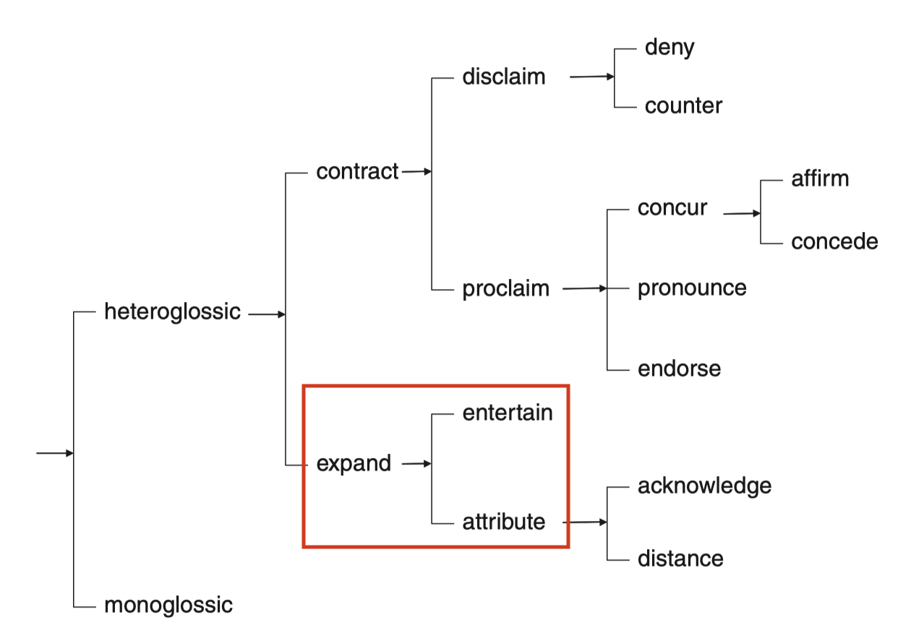
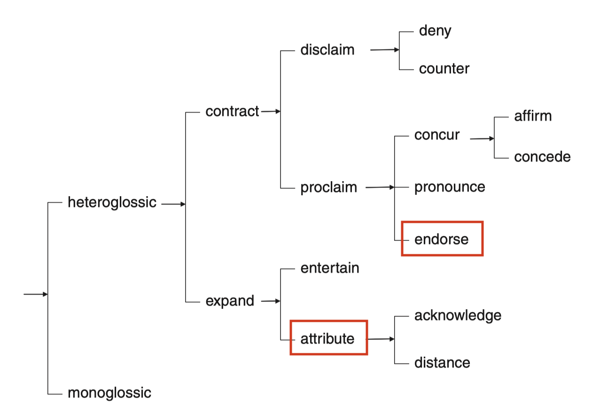
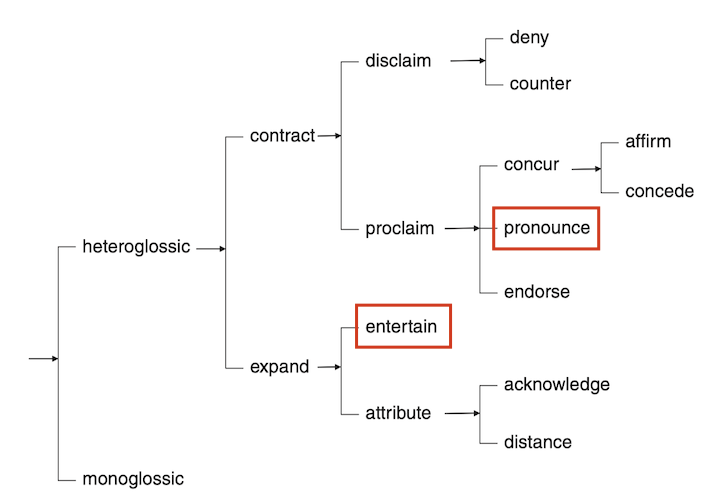

# Some confusing cases

{: .no_toc }
## Table of Contents

{: .no_toc }

1. TOC
{:toc}

---
# Within Expansion  
## Attribute or Entertain

Entertain mainly concerns the writer's own views while attribute is a way to use external voice to present their views.
To differentiate these two, one clear differences is the subject of the communication/mental verb. That is, `who` believes/thinks/argue etc.
If the subject of that sentence is a third person (or external informational source), we consider it as an attribution to an external source.
If the subject of the sentence is related to the author themselves (e.g., I, this paper, etc.), we consider it as an ENTERTAIN move.

- _I **believe (ENTERTAIN)**_ that the government should ...
- I **argue (ENTERTAIN)** that ....
- _Some group of people **believe (ATTRIBUTE)**_ that the government should ...
- Some findings **indicate (ATTRIBUTE)** that ...
- A majority of people **answered (ATTRIBUTE)** that ....

See this contrast in the taxonomy.

# Contraction vs. Expansion

## Endorse (Contraction) or Attribute (Expansion)

Although these two are similar in that both uses `external voice` in their formulations, the main difference concerns **the degree of authors approval of the content of the external material**. 
In `ENDORSE`, the author refers to the external source and show their alignment to the idea in order to advance their argument and contract the dialogic space. On the other hand, the main rhetorical effect of `ATTRIBUTE` is more neutral or distant; the author simply make reference to an external sources. 

- The result **demonstrated (ENDORSE)** that ...
- The author **mentioned (ATTRIBUTE)** that ...

When the writer use communication verbs (argue, state, explain) with intensification to align with that view (e.g., rightly, effectively), then they are ENDORSE.
- The author **convincingly argued (ENDORSE)** that ...
- The paper **rightly pointed (ENDORSE)** out that ....

See this contrast in the taxonomy:

## Pronounce (Contraction) or Entertain (Expansion)

While the two categories shares the idea of "author's subjective viewpoints", the main difference is the degree of writers commitment to their own views. 
`Pronounce` move, where the author puts more intensive emphasis, fends off potential alternative viewpoints.
`Entertain` move allows for alternative interpretations or voices by expressing possibilities or by limiting the applicable cases. 

- _I would **affirm (PRONOUNCE)**_ the judgment of the trail court and deny the motion to suppress Oliver’s statement.
- _I would **guess (ENTERTAIN)**_ the judgment of the trail court and deny the motion to suppress Oliver’s statement.

See this contrast in the taxonomy:

# Confusing Monoglossic patterns

## Attribute or Monogloss
In some cases, communication verb is used to talk about the action itself, not attributing the content of the locution.
Test this by substituting the communication/mental verb with `state/argue` or `think`. If you can find appropriate substitution with basic communication verbs that can function as ATTRIBUTE, then it is likely that the move is also ATTRIBUTE.

- Then, she spoke (MONOGLOSS) to the public. (The focus is on the *action* of speaking, not the content.) 
- Some **say (ATTRIBUTE)** it's cool. (The focus is on the content [AND who says it].)
- They **observed** that the change in the emotion was temporary. (Substitution to `stated/argued` still makes sense, so it is likely to be an ATTRIBUTE.)
- They observed a rare star. (Substitution to `stated/argued` gives you strange sentence, they are description of the action, not the content.)

## Endorse or Monogloss
Similarly to [Attribute or Monogloss](#attribute-or-monogloss), the distinction between Endorse and Monogloss can be tricky.

Consider the following two example where the communication verb SHOW has distinct functions.
- The transitions from winter to summer also **show** an increase in feeding of fruits, flowers, bark, and seeds.
- The evidence **shows** that the increase in proficiency level takes much time.

In the first example, the verb `show` is used more descriptively, the author is talking about visual scene or imagery.
In the second one, the verb is used to endorse the evidence "demonstrating" slow development in proficiency level.

## ENTERTAIN or Monogloss

In the current guideline, we will treat the following pattern as `MONOGLOSSIC`.

### MONOGLOSS
- It **is** important/necessary/vital/critical that a needs assessment be conducted to collect data related to the following.
- It **is** important/necessary/vital for practitioners to allow time to explore client resources and opportunities as fully as possible.

{: .caution}
Why are these monoglossic?
Importantly, these expresses some value judgement on the content/argument itself. These are treated as `MONOGLOSS` because the value is presented without recognizing other value judgement (e.g., unimportant). The writer can further add `EXPANSION` strategies such as `entertain` or `ATTRIBUTE`:

- It **may (ENTERTAIN)** be necessary for practitioners to allow time to explore client resources and opportunities as fully as possible.
- It **seems (ENTERTAIN)** vital for practitioners to allow time to explore client resources and opportunities as fully as possible.
- **Arguably/Apparently (ENTERTAIN)**, it is necessary for practitioners to allow time to explore client resources and opportunities as fully as possible
- **According to Anderson (2002) (ATTRIBUTE)**, it is necessary for practitioners to allow time to explore client resources and opportunities as fully as possible.

### ENTERTAIN
On the other hand, `likelihood` expressions in such construction is treated as `ENTERTAIN`:
- It is **likely/possible/probable** to ...
- It is **possible/probable/unlikely/certain** that ...
- It is **apparent** that ...
- It is **arguable/concievable** that ...

### PRONOUNCE
Yet another category is `PRONOUCE`:
- It is **clear/obvious** that ...

# Other confusing patterns
## Rhetorical questions
Rhetorical questions can have two functions, each corresponding either `Entertain` or `Concur`.

1. A rhetorical question functions as `Entertain` when it introduces "a proposition in such a way that it is presented as but one of a number of possible positions" (White, 2003, p. 267).
2. A rhetorical question functions as `Concur` when it presents "proposition as so self-evident or agreed upon that it doesn’t actually need to be stated by the textual voice, it can be left up to the reader to supply the required meaning." (White, 2003, p. 267)

Rhetorical questions categorized as `Entertain` include following examples:
- **So what brings happiness to our life? (ENTERTAIN)** (Tip: Tag the entire question.)

Rhetorical questions categorized as `Concur` include following:
- **Should we go to war against these children? (CONCUR)** (Tip: Tag the entire question.)

## `whether SV` and `if SV`

In some cases, the embedded clause introduced by `if` and `whether` is confusing to annotate. 

Importantly, we need to think if this construction really ENTERTAINs options. It certainly is used to introduce two possible choices, but it really ENTERTAINs the option needs to be thought carefully considering the co-text (surrounding text).

The following patterns can be thought of `ENTERTAIN` (the span of the tag is bolded):
- I was **not sure whether** she had really understood my correction.
- The researcher is **unsure whether** language proficiency is a potential source of unique variability.
- We **do not know whether** 25% of our language learners' 68% of time on captions is automatic reading.
- **Depending on whether a guess leads to a correct answer**, a guess can be defined as a correct guess or a wrong guess. 

We can thus understand that `whether` is not considered `ENTERTAIN` automatically, but suggest there may be another important pattern that leads to `ENTERTAIN` reading.

Conversely, the following patterns are not immediately considered as `ENTERTAIN`. The option is literally presented, but not entertained. We could perhaps treat the entire embedded clause as secondary engagement.

- In Experiment 1 we **investigate (MONOGLOSS)** whether 7‐ and 12‐month‐old infants can learn simple structures that are based on identity and diversity (same/different) relations.
- A related concern **is (MONOGLOSS)** whether a course of study, such as that suggested by Cultura , provides answers for “what culture” to teach within the language curriculum.
- The p value **shows (MONOLOSS)** whether a parameter estimate was significant.
- To explore whether development in affect contributes to achievement in EFL oral interaction, regression analyses were **conducted (MONOGLOSS)**.
- **Irrespective of whether epilinguistic representations constitute explicit or implicit knowledge (COUNTER)**, what is important is the fact that they are not accessible to consciousness and, consequently, they cannot be verbalized. 

## `would` in I would like to/ I would prefer

In some cases `would` functions as polite expression, not to entertain options. 
When `would` is used as a polite expression, carefully consider whether there is any opinions `ENTERTAINed` by the use of `would`. If not, do not treat them as `ENTERTAIN` and you can leave it untagged.

- I would like to show that .... 
- I would prefer going to ...
- I would like to **argue (ENTERTAIN)** that X.

This is consistent with the observation that expressions for personal preferrence does not take ENTERTAIN tag.

- I **want (MONOGLOSS)** to play cards. (= I would **like (MONOGLOSS)** to play cards)
- I like to go out for coffee. (= I would **like (MONOGLOSS)** to go out for coffee.)

## Multiple engagement resources in a T-unit
Often times, we will find multiple engagement resources in a single unit (T-unit). 
- **As the name implies (ATTRIBUTE)** _it **seemed (ENTERTAIN)**_ as if eating children was one of the main focuses of anti-witch writings.
- **Even (COUNTER)** **if repenting (ENTERTAIN)**, the person **could (ENTERTAIN)** still be deceived by the devil again, and **would (ENTERTAIN)** return as a threat.
- Output in the English language class **may (ENTERTAIN)** **not (DENY)** always be a productive or necessary use of classroom time
- **Though (COUNTER)** these ideas **may (ENTERTAIN)** **not (DENY)** be driving educational policy, they are influencing attitudes in ways that have the potential to affect outcomes.

### Entertain + Deny ( + maximizer)
`Maximizer` includes adverbs such as *always*, *severely*, etc.
- Output in the English language class **may (ENTERTAIN)** **not (DENY)** **always (MAXIMIZER)** be a productive or necessary use of classroom time

### Deny + Entertain ( + maximiser)
- **Not (DENY)** to do so **may (ENTERTAIN)** **severely (MAXIMIZER)** weaken the findings of both.

