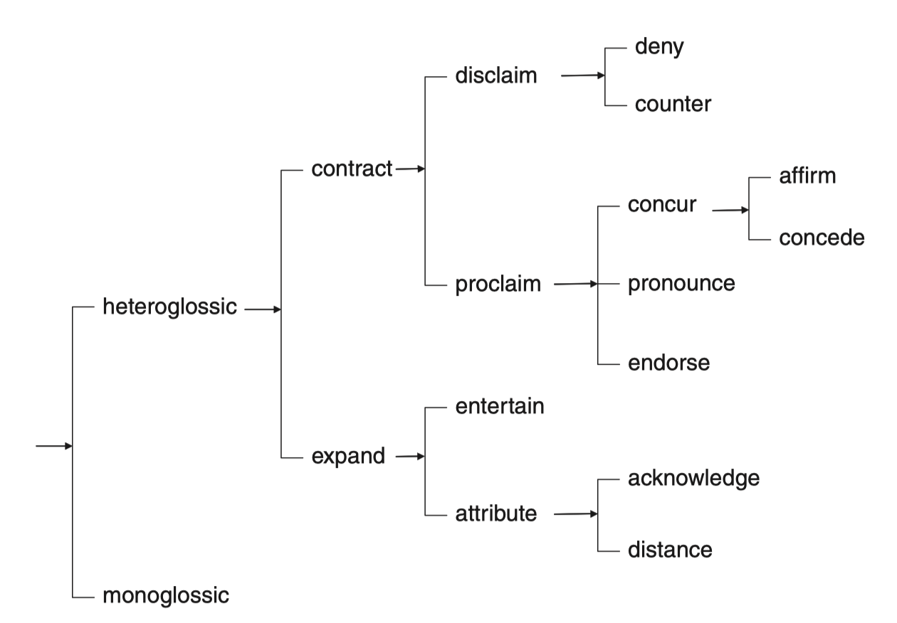

## Engagement coding scheme

There are 9 categories of engagement moves to annotate in the current project (see [Table 1](#table-1-categories-of-engagement-moves)). Most categories belong to "parent" (or more general) discourse moves, such as `contract` and `expand`. 

Figure 2 shows the entire taxonomy. Based on Figure 2, we can understand that we have finer-grained discource moves as we go deeper into the taxonomy (e.g., `heterogloss` > `contract` > `disclaim` > `deny`). I will explain what these categories mean shortly, but remember that this taxonomy presents alternative stance-taking strategies (or discourse choices) a writer can make to position themselves in the writings. 

(Adopted from Martin & White, 2005)

### Core Terminologies
The following sub-sections describe core terminologies (category labels) in the coding scheme.

#### Monogloss and Heterogloss
The first (the most coarse-grained) distinction concerns `monogloss` vs. `heterogloss`, which is about whether the utterance recognizes the alternative positions or not. In Monogloss, the utterance does not recognize any alternative views and presents the idea/event as a fact (e.g., "The banks have been greedy"). On the other hand, a heteroglossic utterance includes various ways to at least acknowledge possible alternatives (e.g., "I speculate that the banks have been greedy", "I read somewhere that the banks have been greedy.", "It is unlikely that the banks have been greedy.", etc.).

#### Expansion and Contraction
A heteroglossic move is divided into `expand` and `contract` moves. The distinction is about whether the writer opens up (`expand`) dialogic spaces for alternative viewpoints or to close down (`contract`) the spaces. 
Essentially, writers use `expand` moves to indicate that the idea is only one possible version of the reality. `Expansion` move is further divided into `entertain` and `attribute`, which are explained later.
On the other hand, writers use `contract` moves to close down the dialogic spaces. They can do this by (a) rejecting alternative viewpoints (`disclaim`) or (b) showing greater committment to their ideas (`proclaim`). 

#### Expansion moves—Entertain and Attribute
`Expansion` move includes discourse moves to (a) increase the tentativeness to the statement (`entertain`) and to (b) attribute the idea to external sources (`attribute`). 
For example, a writer can use lexico-grammatical items such as modal verbs (`can`, `may`) and mental verbs (`I believe`) to `entertain` other possible alternatives. The writers can refer to external sources (e.g., `the paper mentioned`) and remain neutral with respect to the presented idea. 

#### Contraction moves—Disclaim and Proclaim
`Contraction` moves concern different ways the writer advances their own views on the topic, and therefore, narrow down or close down the space for negotiation. 
Writers can `disclaim` other views by using `deny` option (e.g., "That is NOT correct.") or using `counter` option (e.g., "Although the paper may be right, there is another possibility."). 
The writers can `proclaim` their views by (a) assuming that the readers would agree their views (`concur`), (b) explicitly underscoring their views as valid (`pronounce`), or (c) use other's perspective/data/claims as correct and reliable (`endorse`).

{: .note}
> Interrim Summary 
>
>
>- `Monoglossic utterance` = An utterance which involves a factual statement, without recognizing other potential views.
>
>
>- `Heteroglossic utterance` = An utterance which recognizes that the referenced idea is one possible alternatives among others, regardless the author supports or rejects the idea.
>
>
>- `Contraction strategy` = Discourse moves which close down dialogic space; the speaker/writer acts to challenge, fend off or restrict other alternative positions and voices.
>
>
>- `Expansion strategy` = Discourse moves which open-up the dialogic space; the speaker/writer actively makes allowances for dialogically alternative positions and voices.
>

## Table 1. Categories of Engagement moves

| Strategy      | Engagement moves                    | Description                                                                                                                                                                                                                          |
| ------------- | ----------------------------------- | ------------------------------------------------------------------------------------------------------------------------------------------------------------------------------------------------------------------------------------ |
| Contraction   | [Disclaim: Deny](DENY.md)           | An utterance which invokes a contrary position but which at the same time rejects it directly. The contrary position is hence given very little dialogic space.                                                                      |
| Contraction   | [Disclaim: Counter](COUNTER.md)     | An utterance which expresses the present proposition as replacing and thus 'countering' another proposition which would have been expected.                                                                                          |
| Contraction   | [Proclaim: Concur](CONCUR.md)       | An utterance which shows writers' expectation/assumption that the putative readers will agree with the preposition and/or to have the same knowledge.                                                                                |
| Contraction   | [Proclaim: Pronounce](PRONOUNCE.md) | An utterance which expresses a strong level of writer commitment through the author's explicit emphasis and interpolation, thereby closing down the dialogic space.                                                                  |
| Contraction   | [Proclaim: Endorse](ENDORSE.md)     | An utterance which refers to external sources as warrantable, undeniable,  and/or reliable. It expresses the writer’s alignment with and endorsement of an attributed proposition. As such, the dialogic space is somewhat narrowed. |
| Expansion     | [Entertain](ENTERTAIN.md)           | An utterance which indicates author's position but as only one possibility amongst others, thereby opening up dialogic space.                                                                                                        |
| Expansion     | [Attribute](ATTRIBUTE.md)           | An utterance which signifies dialogic space as the writer attributes the proposition to an external source.                                                                                                                          |
| Monogloss     | [Monogloss](MONOGLOSS.md)           | An utterance which does not employ any value of engagement. Such an utterance ignores the dialogic potential in an utterance.                                                                                                        |
| ~~Auxiliary~~ | ~~Justify~~                         | ~~An utterance which engage in persuasion through justification or substantiation.~~                                                                                                                                                 |
| ~~Auxiliary~~ | ~~Citations~~                       | ~~Citation is segment of the text where external source(s) are referenced in the text.~~                                                                                                                                             |

{: .caution}
In version 2 of the guideline, we no longer annotate `JUSTIFY` and `CITATION` at the `ENGAGEMENT` layer. They are moved to [STEP5—supplemetary tag](./../5_supplementary_tags/index.md) with slight modifications.

# Table of Content

The following is the table of content for the manual. 
The original deanonymized version of the manual has sidebars for annotators to navigate through the contents. This could not be implemented in this anonymized version for review.

1. [Overview of annotation steps](./0_overviews.md)
2. [Preliminary concepts](./1_basic_grammar.md)
3. [Step 1 — Clause boundary detection](./1_Clause/index.md)
4. [Step 2 — Span detection](./2_Spans/index.md)
5. [Step 3 — Engagement categories](./3_Categories/index.md)
6. [Step 4 — Primary vs Secondary classification](./Step4_primary_secondary.md)
7. [Step 5 — Suppelementary tags](./5_supplementary_tags/index.md)
8. [Example with Examples](./8_examples-in-context.md)
9. [Recent change](./x_Change_log.md)
10. [WebAnno related documentation](./WebAnno_related.md)
11. [FAQ](./y_FAQ.md)
12. [Bibliography](./z_Bibliography.md)