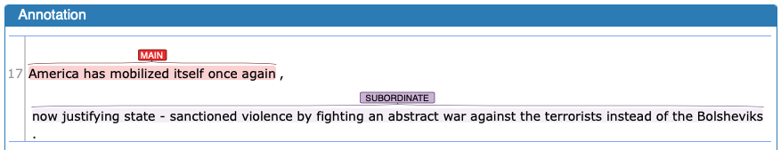
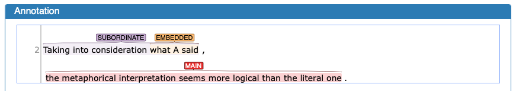
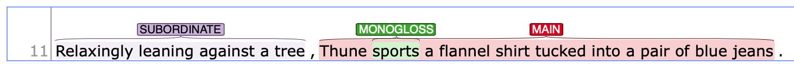

New
{: .label .label-green}
# Clause boundary detection 

Clause boundary detection is an auxiliary task, which aims to help you to think about the overall structure of the sentence before tagging any engagement values. Since this is subordinate task, we do not really do full-fledged clausal analysis, such as non-finite clauses as modifier of nouns, etc.. Thus, the following guideline is not intended to conduct a full clausal analysis, but abbrebiated version that helps us during the engagement annotation.

The followings are how we will tag on different types of clauses:

| Label                               | definition                                                                                                                                                                                                                                                                                                                                  |
| :---------------------------------- | :------------------------------------------------------------------------------------------------------------------------------------------------------------------------------------------------------------------------------------------------------------------------------------------------------------------------------------------ |
| [MAIN](#simple-main-clauses)        | An independent clause, which function as complete unit.                                                                                                                                                                                                                                                                                     |
| [SUBORDINATE](#subordinate-clauses) | A dependent clause attached to a main clause through the use of subordinate conjunctions (e.g., `because`, `although`, `if`, `when`, `as`, `while`, etc.)                                                                                                                                                                                   |
| [EMBEDDED](#embedded-clauses)       | a type of dependent clause that function as a part of another clause. That is, an embedded clause is included in a subject, object of another clause (i.e., complement clause) or function as an adjective to modify a noun (i.e., relative clause). Inserted clauses, such as parataxis, are also considered as a type of embedded clause. |
| [FRAGMENT](#fragment)               | An imcomplete sentential unit. Typically, without any verbs.                                                                                                                                                                                                                                                                                |

{: .note }
When we identify clauses, we do NOT consider punctuation at the end of the clause boundaries as a part of the clause. 

---

## Simple MAIN clauses

{: .def}
> A clause that can stand alone to make a complete sentence.

In addition to "simple" sentence structure, we will include imperative sentences (commands) as a independent main clause.

In webanno, you will annotate the clause in the following manner:

---

## Coordinated clauses – More than one MAIN clauses

{: .def}
> Coordinated clauses are independent/main clauses that are connected via coordinating conjunctions (e.g., `and`, `but`, `or`).

You can also consider colon `:` and semi-colon `:` as an implicit coordination of two MAIN clauses.

| Independent clause            | Coordinated conjunction | Independent clause                  |
| :---------------------------- | :---------------------- | :---------------------------------- |
| Marianne lives in California, | but                     | Diane lives in Michigan or Vermont. |
| He went to the party,         | and                     | I stayed home.                      |
| I went to the store           | but                     | they were closed                    |
| I went to the store           | ;                       | they were closed                    |

In webanno, you will annotate the clause in the following manner:

---

## SUBORDINATE clauses

{: .def}
> a dependent clause that is attached to a main clause through the use of subordinate conjunctions (e.g., `because`, `when`) or adverbial particle

Subordinate clause can take a form of [adverbial clause](#adverbial-clauses) or [non-finite adverbial particle clause](#adverbial-particle-clauses) (see details below.)

A subordinate clause can either follow or preceed the main clause. 

| Main clause                                   | Subordinate clause                                                      |
| :-------------------------------------------- | :---------------------------------------------------------------------- |
| It was hard to write a book together          | **because they live so far apart**.  (adverbial clause)                 |
| Peggy frequently calls                        | **because she wants to stay in touch**.  (adverbial clause)             |
| Betty danced joyfully,                        | **never suspecting what was about to happen**. (particle clause)        |
| They decided to wait for dawn,                | **each hiker taking his two-hour turn at watch**. (particle clause)     |
| The authors presented a new piece of evidence | **concluding that the effects of DLL is noteworthy**. (particle clause) |

| Subordinate clause                                                 | Main clause                             |
| :----------------------------------------------------------------- | :-------------------------------------- |
| **Although Marianne and Diane live far apart**, (adverbial clause) | they are still friends.                 |
| **As far as I am concerned**,  (adverbial clause)                  | there is not much study on this topic.  |
| **Working diligently on his paper**,  (particle clause)            | John began to type up the bibliography. |
| **Worn out from all the work**,   (particle clause)                | John decided to relax.                  |

Following sections describes each type in details.
### Adverbial clauses 

{: .def}
>Adverbial clause is a type of subordinate clause, which typically add 'secondary information' to the main clause.

Common subordinate conjunctions, which introduce a subordinate clause, include:
- **Concessions**: although, as, as though, even, even though, though, just as though, whereas, while
- **Conditions**: even if, if, in case, provided (that), unless, as long as, as much as, as far as,
- **Temporal**: after, as, as soon as, as long as, before, once, since, still, till, until, when, whenever, while
- **Contrasts**: although, though, whereas, while, rather than, 
- **Causal relations**: as, because, in order (that), so that, now that, since

More examples include:

| Subordinate clause                                                                                    | Main clause                                                                                             |
| :---------------------------------------------------------------------------------------------------- | :------------------------------------------------------------------------------------------------------ |
| **Because the steps are made of a smooth, polished—and therefore slippery—stone**,                    | the BTA should’ve taken precautions to clean the steps in such wintry conditions.                       |
| **Although some medical ethicists claim that cloning will lead to designer children** (R. Miller 12), | others note that the advantages for medical research outweigh this consideration (A. Miller 46).        |
| **While the Supreme Court rejected the “quality of care” argument in the federation case**,           | the oligopolistic characteristics and purchasing structure of insurance make this outcome unsurprising. |

Note that the meaning of the subordinating conjunction depends on the context. 

In webanno, you will annotate these in the following manner:

### Adverbial particle clauses

In some cases, a subordinate clause can also be realized with non-finite particles (e.g., `-ing`, `-ed`, `-en`).

| Subordinate clause                                         | Main clause                                                         |
| :--------------------------------------------------------- | :------------------------------------------------------------------ |
| **Having worked on his paper since 4 P.M.**,               | John stopped at 8 to watch the DePaul basketball game.              |
| **Having been working on his paper for more than a week**, | John decided he would turn it in without further revision.          |
| **Being worn out from all the work**,                      | John decided to relax for the evening.                              |
| **The bus drivers being on strike**,                       | many people had to get to work using other means of transportation. |
| **Relaxingly leaning against a tree** ,                    | Thune sports a flannel shirt tucked into a pair of blue jeans .     |

| Main clause                            | Subordinate clause                             |
| :------------------------------------- | :--------------------------------------------- |
| Betty danced joyfully,                 | **never suspecting what was about to happen**. |
| Sheila ignored the dog and the TV set, | **deeply engrossed in the new book**.          |

On webanno, you should segment the clause in the following manner.

---

## Embedded clauses

{: .def}
> a type of dependent clause that function as a part of another clause. That is, an embedded clause is included in a subject, object of another clause (i.e., complement clause) or function as an adjective to modify a noun (i.e., relative clause). Inserted clauses, such as parataxis, are also considered as a type of embedded clause.

In the following examples, embedded clauses are _italicized_.

- The paper argued _[that average price is not a meaningful measure of market power]_. (The clause functions as an object of argue.)
- I wanna eat the ramen _[that she mentioned a couple of days ago]_. (The clause modifies "the ramen".)
- And you will meet a man _[who says American Airlines took away his life]_. (The clause modifies "a man".)
- The idea _[that a democratic school is one where kids have an equal vote (Embedded 1)]_ , _[I think (Embedded 2)]_ , is a mistake. (The clause is a complement of a noun.)

In webanno, you will annotate these in the following manner:

Here are some major types of embedded clauses.

### Verb + (that-)clause (Embedded)
This pattern typically occurs when clausal complement (such as that-clause) follows mental or communication verbs.

- The author argued _that television has helped to shrink the relative distance between people and countries_.
- I think _Mary teaches French_.
- It appears _that maximum price fixing does the greatest harm when set below a competitive level_.

### Noun + (that-)clause (Embedded)
This patterns occurs when a (that-)clause elaborates content of the noun expression. 

- _The idea that the company has a clear responsibility to the incident_ was rejected by the judge.
- Their argument was based on _the belief that a happy ending is a certainty_.
- Our conclusion is drawn based on _the fact that there was a correlation between the intensifier use and their perception of social identity_.

### Relative clauses (Embedded)
A relative clause is where a clause is used to modify a noun (antecedent). There are two main categories in the use of relative clause.

The first type of relative clause occures when a noun is modified by a whole clause. It is typically used to identify which noun they are talking about out of all the possible cases of the noun.
- The analysis should be regarded as _a tool which alerts us to the potential conflicts_.

The other type of relative clause typically elaborates the content of the whole clause or introduces additional information about the noun expression/whole clause.

- We included all participants into the analysis with the exception of _the Italian participants, which was necessary to control for their native languages._ 

---

## Fragment

{: .def}
> Fragment here is defined as an indepent line in the annotation data that does not have any clausal element.

This is mostly due to the automatic sentence segmentation issue or syntactic errors in the original essays.

Examples include:
- (Norris, 2009)
- Ibid. (2008, p. 2)
- For example, 
- ,
- p. 36).
- Sincerely,
- Dear Kris,

These are all categorized as Fragment. Since fragment is used to detect any non-clausal, minor textual segments in the data, it won't be used with other categories. That is, when a sentence have at least one `Main`, `Subordinate`, or `Embedded`, that sentence do not get `Fragment`.

Conversely, the followings are still categorized into `Main` even if they seems they are cut off in the middle:

- The author argues:
- He went to France via 
- No one seems to disagree with the view that 

The examples above are considered `Main` clause because there is at least one [finite verb](1_Basic_grammar.md)—`argues`, `went to`, and `seems`.
We are going to treat these example as 

Note that Empty lines has automatically converted to `EMPTYSENT—Skip Annotation`. When you encounter this, just skip the sentence.

---

## Real examples—Mixture of different clause types

In real example, we will deal with mixture of different types. 
This is illustrated in the following examples.

### Comments on the real examples

20: The subject of this sentence is `The idea`, and the main verb is `is`. There are two embedded clauses. One is a complement of the noun `idea`, which elaborates on the content of that idea (i.e., complement clause). The other is `I think`, which function as attached (i.e., parataxic) node to the main clause. 

21: We have one additional subordinate clause and an additional embedded clause in this example. The embedded clause is the content of the main verb (i.e., the content of what the citizens believe). Grammatically, this is called a complement clause of the main verb. The embedded clause has two parts, Embedded-main, which we do not tag, and Embedded-subordinate, which we will treat as a subordinate clause.

22: This example has one additional embedded clause functioning as the complement of the verb `feel`.

23: This example has one additional subordinate clause. The subordinate clause is introduced by a subordinate conjunction `as`, which add secondary information to the main clause.

24: This example has two main clauses, and there is one subordinate clause, which I consider attached to the first main clause. We have two main clauses because both parts has finite verbs "the player **is** ..." and "they must **pay** ...". The semi-colon works as implicit coordination between the clauses. Finally, the subordinate clause is introduced by a subordinate conjunction `once`, which add extra Temporal information to the main clause (c.f., `before/after/since Y do X`).

25: This has two main clauses, coordinated implicitly by a colon `:`. The first MAIN clause has additional embedded clause, which is the complement of the verb `argue`.  

## Problems in the sentence segmentation

Sometimes, the annotation dataset may have weird lines. This may include completely empty lines, or just a word in line. It can also have cases where in-text citations are ill-formatted.

1. IF the dataset has empty lines, skip annotating that line.
2. If the sentence is imcomplete, use the `FRAGMENT` tag.
  - In 1999, (FRAGMENT)
  - are examples of this concept (FRAGMENT)

## References
Larsen-Freeman, D., & Celce-Murcia, M. (2016). *The grammar book. Form, meaning and use for English language teachers* (3rd eds).
