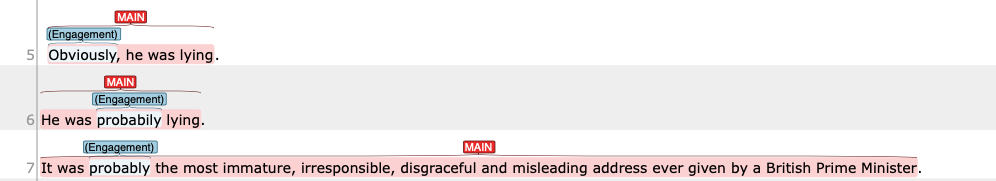
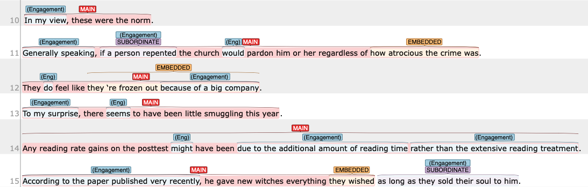
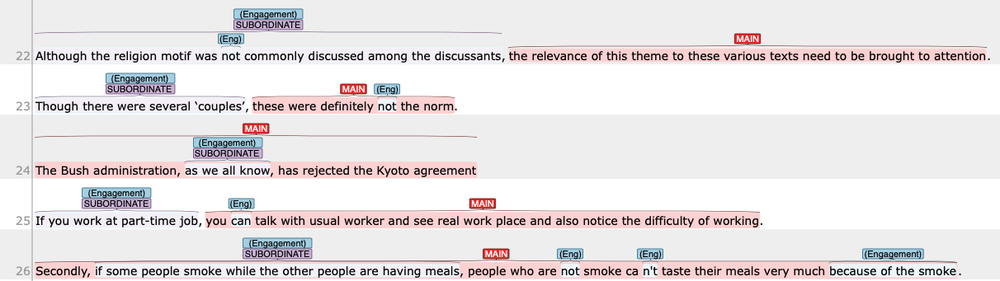
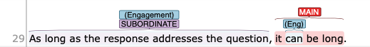

# Part 3 — Engagement tagging: Rules and Spans
{: .no_toc }
## Table of Contents
{: .no_toc }

1. TOC
{:toc}

---
# Tag spans by item type—Where exactly to put a tag on?
Because meanings of engagement can be expressed at different levels of lexical and grammatical items, we need to know exactly which part of the sentence we should put a tag on.
This section deals with such structural issues during the annotation. Each section below deals with possible grammatical structure for emgagement, and which items to put a tag on.

In the example in this document, the span for which the tag should be put is shown in **Bold** face. Updated {.label .label-green}

| Features                                                                                                                   | Example items                                       | Where to put a tag            |
| -------------------------------------------------------------------------------------------------------------------------- | --------------------------------------------------- | ----------------------------- |
| [Modal verbs](#modal-verbs)                                                                                                | can, have to                                        | on the item                   |
| [Single-word adverbs](#single-word-adverbs)                                                                                | obviously, sure                                     | on the item                   |
| [Adverbial/ Prepositional constituency](#multi-word-adverbs-adverbial-and-prepositional-constituency)                      | in my view                                          | the entire phrase             |
| [Mental or communication verbs](#mental-or-communication-verbs)                                                            | think, say, tell                                    | on the item                   |
| [Subordinate conjunctions](#subordinate-clause-revised-on-april-9th)  **Updated on April 9th**                             | as, when, if                                        | the entire subordinate clause |
| [Multi-word subordinate conjunctions](#multi-word-subordinate-conjunctions-revised-on-april-9th)  **Updated on April 9th** | as long as, whether or not                          | the entire subordinate clause |
| [Coordinating conjunctions](#coordinating-conjunctions)                                                                    | but, and, yet                                       | on the item                   |
| [Question](#questions)                                                                                                     | Who thinks that smoking do no harm in 21st century? | on the entire question        |
| [It is ADJ that construction](#it-is-adj-that-interpersonal-metaphor)                                                      | It is unlikely that ....                            | On the construction           |
| [Citations](#citations)                                                                                                    | Kyle (2020); (Kyle, 2020)                           | See details                   |

## Modal verbs

When an engagement meaning is realized by a modal verbs (e.g., can, may, might, have to, etc.), you will put a tag on the modal.
- He **may** be lying.
- Teachers **should** show students the language needed to achieve these rhetorical features of argumentative writing.

## Single-word adverbs

When an engagement meaning is realized by a single word adverbs (e.g., probably, surprisingly, etc.), you will put a tag on the item.
- **Obviously**, he was lying. 
- He was **probabily** lying,

## Multi-word adverbs/ adverbial and prepositional constituency

When an engagement meaning is realized by a multi-word adverbs, such as prepositional phrases, adverbial phrases, you will put a tag on the whole constituency.
- **In my view**, these were the norm.
- **Generally speaking**, if a person repented the church would pardon him or her regardless of how atrocious the crime was.
- They do feel like they 're frozen out **because of a big company**.
- Any reading rate gains on the posttest might have been **due to the additional amount of reading time rather than the extensive reading treatment**.

## Mental or Communication verbs

When an engagement meaning is realized by a mental or communication verbs, you will put a tag on the lexical verb.
- Our analysis **confirms** previous work showing that incorporating various perspectives on an issue is a valuable feature of argumentative, analytical writing.

## Subordinate clause ==(Revised on April 9th)==

When an engagement meaning is realized by a subordinate conjunctions such as *although*, *while*, and *if*, you will put a tag on **the entire subordinate clause** (Modified on April 9th).
- **Although the religion motif was not commonly discussed among the discussants**, the relevance of this theme to these various texts need to be brought to attention.
- **Though there were several ‘couples’**, these were definitely not the norm.
- The Bush administration, **as we all know**, has rejected the Kyoto agreement

## Multi-word subordinate conjunctions ==(Revised on April 9th)==

When an engagement meaning is realized by a multi-word subordinate conjunctions such as *as long as* and *where or not*, you will put a tag on **the entire subordinate clause** (Modified on April 9th).
- **As long as the response addresses the question**, it can be long.

## Coordinating conjunctions

When an engagement meaning is realized by a coordinating conjunctions such as *but* and *yet*, you will put a tag on that item.
- **But** look at what he achieved.
- Schools do not serve as avenues for upward mobility, **but** instead reinforce existing social and economic inequalities.

## Questions

When an engagement meaning is realized by a question, we will tag the whole question **INCLUDING the question mark**. This will result in **not completely overlapping span** for clause detection and engagement because clause detection does not include punctuation at the end of the clause.

## It is ADJ that— Interpersonal metaphor

When there is `It is ADJ that ~` construction, we will tag the entire span of this construction.

## Citations

For citations, we will tag the entire span of the citation.
Sometimes, due to the sentence segmentation issue, the dataset will include citations cut in the middle (see the last example in the screenshot).
- The extremely high prevalence of child and adolescent exposure to violence in U.S. inner-cities <engmt class="monogloss">is</engmt> alarming **(Bell &amp;amp**.

