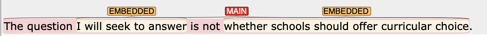
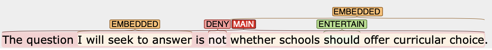

# Part 5 — Engagement tagging: Rules and Spans
{: .no_toc }

## Table of Contents
{: .no_toc }

1. TOC
{:toc}

---

# Annotation procedure

Updated on May 7th, 2022
{: .label .label-green}

## 1. Clause boundary detection

For each sentence, annotation should start with clause boundary segmengation and clause type identification.
I will not repeat the content here, but you should refer to the [clause boundary detection](3_Part2_Clause_boundary.md) for details.

### Part of Speech layers.
You can refer to Part-Of-Speech (POS) tags automatically generated by spaCy during the annotation. 
There are two layers in the POS annotation. One is coarse-grained (UPOS); the other is finer-grained (XPOS).
For UPOS, see the following documentation from [Universal Dependency project](https://universaldependencies.org/u/pos/).
For XPOS, see the following table from spaCy documentation on [POS scheme](https://v2.spacy.io/api/annotation#pos-tagging).

## 2. Modal sense disambiguation

Once a sentence has been annotated for clause boundary and types, we will annotate the sense of modal verbs (if any).
This will allow us to prepare for the following engagement annotation because although most modal verbs function as `entertain` it is not always the case.

See [Modal sense Disambiguation](Modal-verb-sense.md) for details of this step.

## 3. Engagement annotation

When you annotate a sentence for Engagement, we first focus on identifying **primary** engagement strategy in a sentence. This is followed by tagging **secondary** engagement strategies. 
To decide the categories of engagement, see [Engagement category](2_Part1_Understanding_Engagement.md).

### 3a. Primary engagement strategies

Primary engagement strategies are those that characterize the engagement of a `MAIN` clause. This means that a construction with an engagement meaning (a) occurs within the `MAIN` clause but not in an `EMBEDDED` clause OR (b) corresponds to the span of a `SUBORDINATE` clause. 

Consider the following monoglossic utterance:

> The best method to understand how language proficiency develops is to look at large-scale observations from various sources.

This utterance is monoglossic because the writer uses present tense 'is' to present the idea as if it is a fact. This is called a bare assertion (= `Monogloss`).

Primary engagement strategies will change the "tone" of this statement, either `expand` or `contract` the discourse:

- **In my opinion (ENTERTAIN)**, the best method to understand how language proficiency develops is to look at large-scale observations from various sources.
- **Perhaps (ENTERTAIN)**, the best method to understand how language proficiency develops be to look at large-scale observations from various sources.
- The best method to understand how language proficiency develops **would (ENTERTAIN)** be to look at large-scale observations from various sources.
- Researchers **proposed (ATTRIBUTE)** that the best method to understand how language proficiency develops is to look at large-scale observations from various sources.
- **Although it takes a great amount of effort (COUNTER)**, the best method to understand how language proficiency develops is to look at large-scale observations from various sources.

#### MONOGLOSS should be used when JUSTIFY and CITATION is the only other moves.

Because `Justify` and `Citation` is treated as auxiliary engagement moves, we will tag `MONOGLOSS` to indicate that the sentence itself is presented `monoglossic`. For example:

- I **decided (MONOGLOSS)** to writer a letter to the author **because the figure contained an error (JUSTIFY)**.

The reason for this is that `Justify` and `Citation` is not determine the engagement of the whole clause (they are neither `expand` or `contract` the discourse).

### 3b. Secondary engagement strategies

Secondary engagement strategies occur in the `EMBEDDED` or `SUBORDINATE` clauses. They do not affect the overall engagement strategy of the sentence, but still contribute to the discourse to some extent.

Even the primary strategy is monoglossic, the sentence can still have secondary engagement strategies.

- The best method to understand how language proficiency **may (ENTERTAIN)** develop **is (MONOGLOSS)** to look at large-scale observations from various sources.

In this example, the primary engagement strategy is monoglossic because there is no engagement resources that satisfies the criteria of primary engagement strategy defined above. However, it still has a modal verb (may) in an `EMBEDDED` clause. This modal very takes on secondary engagement (or `ENTERTAIN` category) in the sentence. It does not influence the overall clausal strategy, but still be considered entertaining the presupposed idea of the sentence.

### Additional tips
The following steps are meant to help you to look for potential linguistic structures that engagement strategy can surface. This is not an exhaustive list, so they should be used as only a recommended guidance. 

### Functional perspective

1. Does the sentence hedge their statement (e.g., expression of likelihood)?
2. Does the sentence refer to any external sources (`ATTRIBUTE` or `ENDORSE`)? (see [Endorse vs Attribute](5_Part4_confusing_tags.md#endorse-contraction-or-attribute-expansion))
3. Does the sentence assert their own point of view WITHOUT recognition to others (i.e., `Monogloss`)?
4. Does the sentence recognize alternative view so as to disclaim (`DENY` or `COUNTER`)?

### Structural perspective
1. Look out for any verbs in the main clause; Are they potentially engagement item (e.g., `say`, `believe`); Who says or believes?
2. Look for any conjunctions and adverbial phrases in the main clauses.
3. Look for any modal verbs, negative particles.
4. Does the sentence cite any sources?

# Procedure at work 

Consider the following example:
> The question I will seek to answer is not whether schools should offer curricular choice.

This sentence is annotated for clause types as follows:

1. First, we look for any engagement in the main clause (= see [Primary engagement strategy](#3a-primary-engagement-strategies)). In this case we have `not` in the main clause, which is `DENY`.

2. Next, we look at the two embedded clauses. We find modal verbs in both clauses, so we need to think about the in which sense these are used.
   - We consider that the first one is more related to `willingness` and `temporal` meaning than, for example, `epistemic`. So, we do not think this one is `ENTERTAIN`. 
   - On the other hand, the second modal verb `should` is used in the `deontic` sense, which suggests that it can be considered `ENTERTAIN`.

Going through this process, the annotation for this example sentence will look like:

