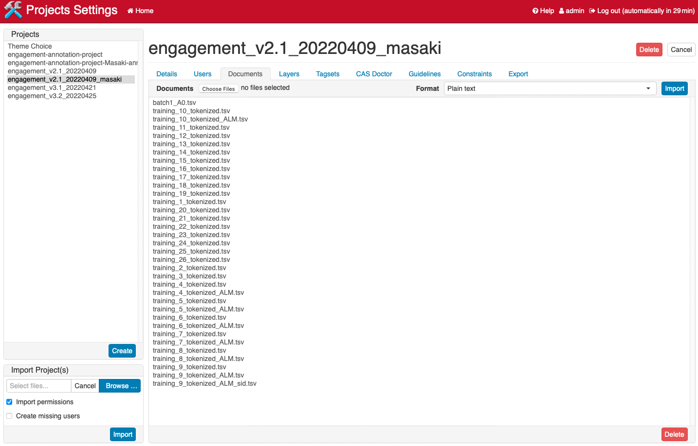
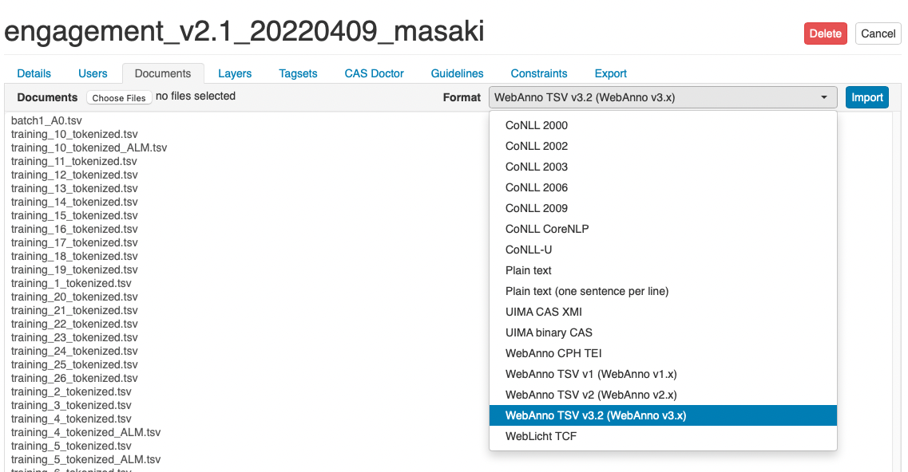

# WebAnno related documentation (Under construction)
This is documentation related to WebAnno software.

## Exporting annotated files
Completed files should be exported from WebAnno and be uploaded to Google Doc.

### Exporting each files
1. From annotation window, select `export` under `Document` menu.
2. Select `WebAnno TSV v3.2 (WebAnno v3.x)` as the export format.
3. Press Export.
   - This should save the exported file in your local computer. 
4. Upload the `.tsv` file on Goodle doc.

### Exporting the whole project
Once in a while, it may be a good idea to export the whole project as a backup.
1. From the WebAnno home memu, select `projects`
2. Select `engagement-annotation-project`.
3. From the tab, select `export`
4. Select `AUTO` and press `Export the whole project`
5. If you are using `Safari` as the web browser, you might need to change the preference to successfully export the file. 
   - IF you are using `Safari`, go to `preference` > `general`, and deselect `Open "safe" files after downloading` option.

## Importing the annotation document

To import the document to annotate, go to `project setting` > `Documents tab` (see the following screenshot).

Then press `Choose Files` to select your files. Choose `WebAnno TSV v3.2 (WebAnno v3.x)` from the the Format. 

Then press import and wait a little while (this step may take a little depending on the number of document you are importing). 

If no error message shows up, you are good to go.

Note, sometimes if you have a file with the same name already loaded, WebAnno prevents from overwriting the file. 
You can change the name of the new file slightly (for example, adding dates e.g., `{name}_20220425.tsv`), this will import the file as a separate version.

## Enabling the annotation across sentence boundary.
To enable annotation across sentence boundaries, follow the instruction below:

1. Go to project.
2. Select the current project.
3. Go to `Layer` tab, then select `named entity`.
4. In the middle column, scroll down the page, and you will find an option `allow annotation to cross sentence boundary`. 
5. Select that option, and click save at the bottom of the column.
You should be able to annotate the text segment across sentence boundaries.

